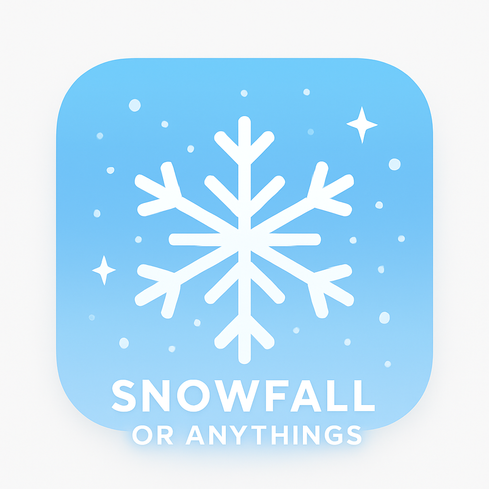

<div align="center">
  
</div>

# Snowfall or Anythings

A Flutter package to create beautiful snowfall or other particle effects in your applications with high performance and extensive customization options.

## Features

- 🎨 Multiple particle types (circular, snowflake, or custom)
- ⚡ High performance with optimized rendering
- 🎮 Full control over animation parameters
- 🔧 Highly customizable (colors, sizes, speeds, shapes)
- 📱 Responsive design with proper screen adaptation
- 🎯 Custom painter support for advanced effects
- 🧩 Widget-based particles for maximum flexibility
- ⏱️ Configurable frame rate for performance tuning

## Installation

Add the following to your `pubspec.yaml` file:

```yaml
dependencies:
    snowfall_or_anythings: ^0.0.5
```

Then run:
```bash
flutter pub get
```

## Usage

### Basic Snowfall Example

The simplest way to add a snowfall effect to your app:

```dart
import 'package:snowfall_or_anythings/snowfall_or_anythings.dart';

class SnowPage extends StatelessWidget {
  const SnowPage({super.key});

  @override
  Widget build(BuildContext context) {
    return Scaffold(
      appBar: AppBar(
        title: const Text('Snowfall Demo'),
      ),
      body: const SnowfallOrAnythings(
        numberOfParticles: 200,
        particleSize: 4.0,
        particleSpeed: 0.8,
        particleType: ParticleType.snowflake,
      ),
    );
  }
}
```

### Circular Particles

Use circular particles instead of snowflakes:

```dart
SnowfallOrAnythings(
  numberOfParticles: 150,
  particleSize: 6.0,
  particleSpeed: 1.2,
  particleColor: Colors.blue,
  particleType: ParticleType.circular,
)
```

### Performance Tuning

Control the frame rate for performance optimization:

```dart
SnowfallOrAnythings(
  numberOfParticles: 300,
  particleSize: 4.0,
  particleSpeed: 1.0,
  particleType: ParticleType.snowflake,
  frameRateMs: 33, // ~30 FPS for better battery life
)
```

**Frame rate guide:**
- `8ms` = ~120 FPS (very smooth, higher CPU usage)
- `16ms` = ~60 FPS (default, balanced)
- `33ms` = ~30 FPS (good for battery saving)

### Custom Painter Example

Create your own particle shapes with custom painters:

```dart
class CustomPaintPage extends StatelessWidget {
  const CustomPaintPage({super.key});

  @override
  Widget build(BuildContext context) {
    return Scaffold(
      appBar: AppBar(
        title: const Text('CustomPainter Demo'),
      ),
      body: SnowfallOrAnythings(
        particleColor: Colors.green,
        numberOfParticles: 150,
        particleSize: 10.0,
        particleSpeed: 2.0,
        customPainter: ({required particles}) =>
            CustomParticlePainter(particles),
      ),
    );
  }
}

class CustomParticlePainter extends CustomPainter {
  final List<Particle> particles;

  CustomParticlePainter(this.particles);

  @override
  void paint(Canvas canvas, Size size) {
    final paint = Paint();

    for (final particle in particles) {
      paint.color = particle.color;
      // Draw squares instead of circles
      canvas.drawRect(
        Rect.fromCenter(
          center: Offset(particle.x, particle.y),
          width: particle.size,
          height: particle.size,
        ),
        paint,
      );
    }
  }

  @override
  bool shouldRepaint(covariant CustomPainter oldDelegate) => true;
}
```

### Widget-Based Particles

Use any Flutter widget as particles:

```dart
SnowfallOrAnythings(
  numberOfParticles: 50,
  particleSize: 20.0,
  particleSpeed: 1.5,
  particleWidget: const Icon(
    Icons.favorite,
    color: Colors.red,
  ),
)
```

Or use images:

```dart
SnowfallOrAnythings(
  numberOfParticles: 100,
  particleSize: 30.0,
  particleSpeed: 1.0,
  particleWidget: Image.asset('assets/snowflake.png'),
)
```

## Result


## Parameters

### SnowfallOrAnythings

| Parameter | Type | Default | Description |
|-----------|------|---------|-------------|
| `numberOfParticles` | `int` | `200` | Number of particles to display on screen |
| `particleColor` | `Color` | `Colors.white` | Color of the particles (for built-in types) |
| `particleSize` | `double` | `4.0` | Maximum size of particles in logical pixels |
| `particleSpeed` | `double` | `1.0` | Maximum falling speed of particles |
| `particleType` | `ParticleType` | `ParticleType.snowflake` | Type of particle: `circular` or `snowflake` |
| `customPainter` | `Function?` | `null` | Custom painter for advanced particle rendering |
| `particleWidget` | `Widget?` | `null` | Custom widget to use as particle |
| `frameRateMs` | `int` | `16` | Frame duration in milliseconds (16ms ≈ 60 FPS) |

### ParticleType

```dart
enum ParticleType {
  circular,   // Simple circular particles
  snowflake,  // Detailed snowflake shapes
}
```

## Performance Tips

1. **Reduce particle count** on lower-end devices:
   ```dart
   numberOfParticles: MediaQuery.of(context).size.width > 600 ? 200 : 100
   ```

2. **Adjust frame rate** for battery life:
   ```dart
   frameRateMs: 33  // 30 FPS instead of 60 FPS
   ```

3. **Use simpler particle types**:
   ```dart
   particleType: ParticleType.circular  // Faster than snowflake
   ```

4. **Avoid complex widgets** as particles if you need many of them

## Advanced Examples

### Colored Rain Effect

```dart
SnowfallOrAnythings(
  numberOfParticles: 300,
  particleSize: 2.0,
  particleSpeed: 3.0,
  particleColor: Colors.blue.withOpacity(0.6),
  particleType: ParticleType.circular,
)
```

### Slow Motion Confetti

```dart
SnowfallOrAnythings(
  numberOfParticles: 100,
  particleSize: 8.0,
  particleSpeed: 0.5,
  customPainter: ({required particles}) => ConfettiPainter(particles),
  frameRateMs: 16,
)
```

## Changelog

See [CHANGELOG.md](CHANGELOG.md) for a detailed version history.

## License

This project is licensed under the MIT License - see the [LICENSE](LICENSE) file for details.

## Contributing

Contributions are welcome! Please feel free to submit a Pull Request.

## Issues

Found a bug or have a feature request? Please [open an issue](https://github.com/ValdirGiorgi/snowfall_or_anythings/issues).

## Author

**Valdir Giorgi**
- GitHub: [@ValdirGiorgi](https://github.com/ValdirGiorgi)
